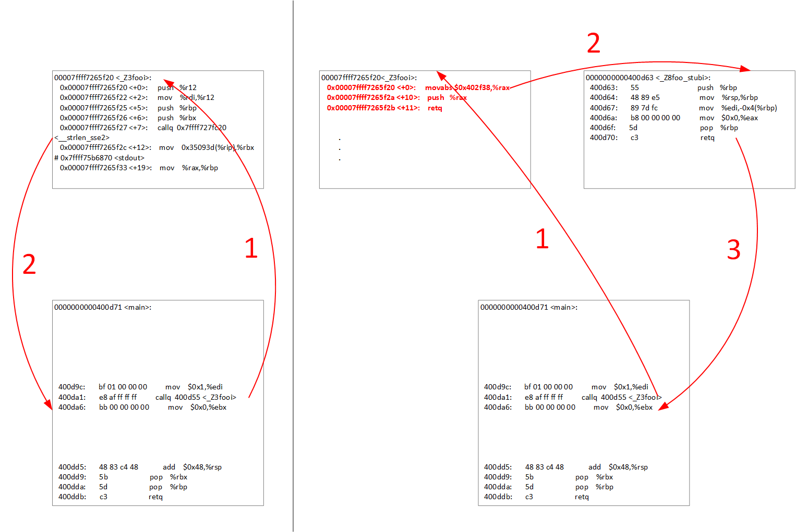
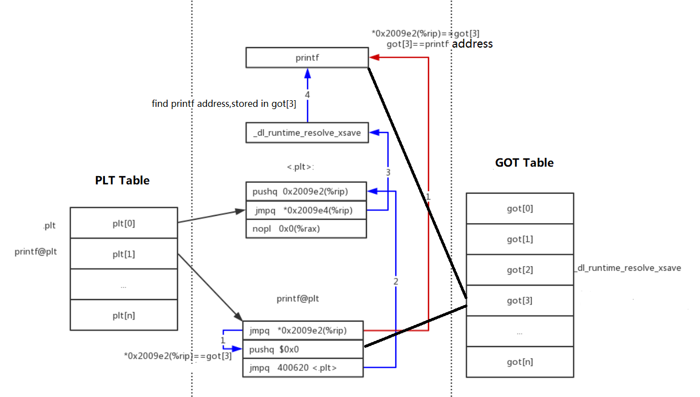
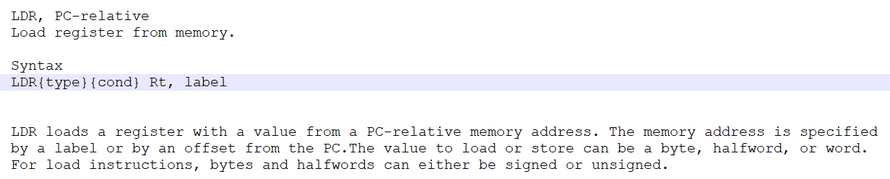
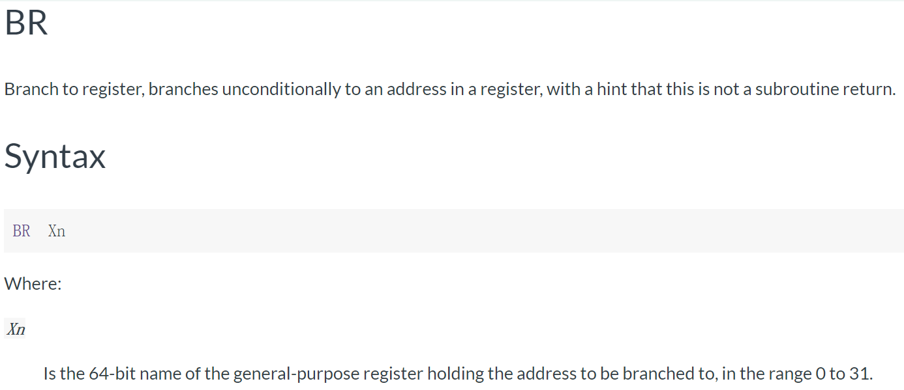
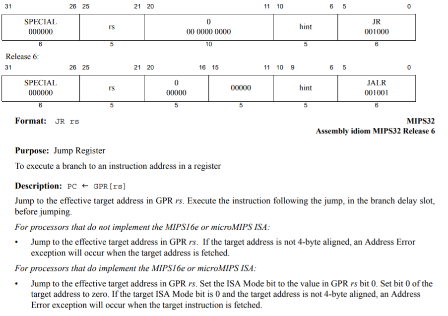

[中文](README_zh.md)|[English](README.md)


# 原理介绍
## 两个核心点
- 如何获取原函数的地址(**addr_pri.h**、**addr_any.h**)
- 如何用桩函数替换原函数(**stub.h**)

## 一些说明
- stub.h(适合 windows, linux) 基于C++98开发; 使用 inline hook 技术; 主要解决函数替换问题 (相关参考:[stub](https://github.com/3gguan/stub.git))
- addr_pri.h(适合 windows, linux) 基于C++11开发; 主要解决对象的私有方法地址获取问题 (相关参考:[access_private](https://github.com/martong/access_private))
- src_linux/addr_any.h(仅适合 linux) 基于C++98开发; 使用 elfio 库查询ELF格式文件的符号表获取函数的地址 (也可以使用 bfd 库); 主要解决静态函数地址获取问题，前提编译时得包含调试信息 (相关参考:[ELFIO](https://github.com/serge1/ELFIO)、[bfd](https://sourceware.org/binutils/docs/bfd/))
- src_win/addr_any.h(仅适合 windows) 基于C++98开发; 使用 dbghelp 库查询PDB文件的符号表获取函数的地址; 主要解决静态函数地址获取问题，前提编译时得包含调试信息 (相关参考:[symbol-files](https://docs.microsoft.com/zh-cn/windows/desktop/Debug/symbol-files)、[dbghelpexamples](http://www.debuginfo.com/examples/dbghelpexamples.html)、[pelib](http://www.pelib.com/index.php))
- 使用时linux和windows还是有差别的, 主要涉及桩函数的写法, 还有原函数地址获取的方法不同; 获取虚函数的地址方法就不同，主要是C++ABI不兼容, 编译器支持不同(相关参考: [cxx-abi](https://itanium-cxx-abi.github.io/cxx-abi/abi.html#vtable))
- 支持的操作系统 : windows,linux
- 支持的硬件平台 : x86,x86-64,arm64,arm32,mips64
- 支持的编译器 : msvc,gcc,clang
- 未来计划支持 macOS

## GOT/PLT Hook 、 Trap Hook 对比 Inline Hook

| | GOT/PLT Hook | Trap Hook | Inline Hook |
| --- | --- | --- | --- |
| 实现原理 | 修改延时绑定表 | SIGTRAP断点信号 | 运行时指令替换 |
| 粒度 | 方法级 | 指令级 | 指令级 |
| 作用域 | 窄 | 广 | 广 |
| 性能 | 高 | 低 | 高 |
| 难度 | 中 | 中 | 极高 |


- Inline hook



- GOT/PLT hook



- Trap hook

陷阱就是用户态的异常，比如除零操作和访问无效内存等，还有系统调用也是。

[ptrace](https://man7.org/linux/man-pages/man2/ptrace.2.html)

[Backtrace](https://www.gnu.org/software/libc/manual/html_node/Backtraces.html)

[Signal](https://www.gnu.org/software/libc/manual/html_node/Signal-Handling.html)

[Windows SEH](https://docs.microsoft.com/en-us/cpp/cpp/structured-exception-handling-c-cpp?view=vs-2019)

[Linux EH](http://wiki.dwarfstd.org/index.php?title=Exception_Handling)

[Linux SEH](https://gcc.gnu.org/wiki/WindowsGCCImprovements)

[VEH and INT3 for windows](https://gist.github.com/coolxv/713f3cc6d013ad49c1a01804f24036d2)

[Signal、Backtrace and INT3 for linux](https://gist.github.com/coolxv/22e92aa307cd9346fb6172385fb23fa8)


## X86/X64 跳转指令


## Aarch32/Aarch64 跳转指令





## Mips64 跳转指令


# 单元测试相关说明
## 不能打桩
- 不能对 exit 函数打桩,编译器做优化了
- 不能对纯虚函数打桩, 纯虚函数没有地址
- 不能对 lambda 函数打桩, lambda 函数获取不到地址
- 不能对静态函数打桩, 静态函数地址不可见.(但可以尝试使用 addr_any.h 接口获取地址)


## 测试替身(来自网络)
- Dummy objects are passed around but never actually used. Usually they are just used to fill parameter lists.
- Fake objects actually have working implementations, but usually take some shortcut which makes them not suitable for production (an InMemoryTestDatabase is a good example).
- Spy are stubs that also record some information based on how they were called. One form of this might be an email service that records how many messages it was sent.
- Mock are pre-programmed with expectations which form a specification of the calls they are expected to receive. They can throw an exception if they receive a call they don't expect and are checked during verification to ensure they got all the calls they were expecting.
- Stub provide canned answers to calls made during the test, usually not responding at all to anything outside what's programmed in for the test.

## 单元测试框架
- gtest、gmock https://github.com/google/googletest
- cppunit https://github.com/epronk/cppunit
- catch2 https://github.com/catchorg/Catch2
- Boost.Test https://github.com/boostorg/test
- cpputest https://github.com/cpputest/cpputest
- doctest https://github.com/onqtam/doctest
- kmtest https://github.com/SergiusTheBest/kmtest
- trompeloeil https://github.com/rollbear/trompeloeil
- FakeIt https://github.com/eranpeer/FakeIt(Mocking Solution)
- isolate++(Mocking Solution,免费，但不开源) https://www.typemock.com/isolatorpp-product-page/isolate-pp/

## 用例自动测试工具
### 开源软件
- [api-sanity-checker](https://github.com/lvc/api-sanity-checker)
- [SVF](https://github.com/SVF-tools/SVF)

### 商业软件
- [Wings](http://www.codewings.net/)
- [C++test](https://www.parasoft.com/products/ctest/)
- [VectorCAST/C++](https://www.vector.com/int/en/products/products-a-z/software/vectorcast/vectorcast-c/)
- [Visual Unit](http://www.kailesoft.com/download/download_detail/23.html)

### 模糊测试&&符号执行
- [AFL](https://github.com/google/AFL)
- [RamFuzz](https://github.com/dekimir/RamFuzz)
- [deepstate](https://github.com/trailofbits/deepstate)
- [klee](https://github.com/klee/klee)
- [s2e](https://github.com/S2E/s2e)
- [symCC](https://github.com/eurecom-s3/symcc)
- [Triton](https://github.com/JonathanSalwan/Triton/)
- [QSYM](https://github.com/sslab-gatech/qsym)
- [angr](https://github.com/angr/angr)
- [Awesome Symbolic Execution](https://github.com/enzet/symbolic-execution)
- [Awesome Fuzzing](https://github.com/secfigo/Awesome-Fuzzing)
### 变异测试
- [dumbmutate](https://github.com/RagnarDa/dumbmutate)

### 因子组合覆盖测试
- [pict](https://github.com/microsoft/pict)

## 单元测试编译选项, linux g++可用的
- -fno-access-control
- -fno-inline
- -Wno-pmf-conversions
- -Wl,--allow-multiple-definition
- -no-pie -fno-stack-protector
- -fprofile-arcs
- -ftest-coverage


## 代码覆盖率, linux g++使用方法
```
lcov -d build/ -z
lcov -d build/ -b ../../src1 --no-external -rc lcov_branch_coverage=1 -t ut -c -o ut_1.info
lcov -d build/ -b ../../src2 --no-external -rc lcov_branch_coverage=1 -t ut -c -o ut_2.info
lcov -a ut_1.info -a ut_2.info -o ut.info
genhtml -o report/ --prefix=`pwd` --branch-coverage --function-coverage ut.info
```
## 代码覆盖率, Windows使用方法
 [OpenCppCoverage](https://github.com/OpenCppCoverage/OpenCppCoverage)
```
OpenCppCoverage.exe --sources MySourcePath* -- YourProgram.exe arg1 arg2
```

# 接口介绍

## stub.h
```
Stub stub
stub.set(addr, addr_stub)
stub.reset(addr)
```

## addr_pri.h
```
Declaration:
    ACCESS_PRIVATE_FIELD(ClassName, TypeName, FieldName)
    ACCESS_PRIVATE_FUN(ClassName, TypeName, FunName)
    ACCESS_PRIVATE_STATIC_FIELD(ClassName, TypeName, FieldName)
    ACCESS_PRIVATE_STATIC_FUN(ClassName, TypeName, FunName)

Use:
    access_private_field::ClassNameFieldName(object);
    access_private_static_field::ClassName::ClassNameFieldName();
    call_private_fun::ClassNameFunName(object,parameters...);
    call_private_static_fun::ClassName::ClassNameFunName(parameters...);
    get_private_fun::ClassNameFunName();
    get_private_static_fun::ClassName::ClassNameFunName();
```

## addr_any.h(linux)
```
AddrAny any //for exe
AddrAny any(libname) //for lib
int get_local_func_addr_symtab(std::string func_name_regex_str, std::map<std::string,void*>& result)
int get_global_func_addr_symtab(std::string func_name_regex_str, std::map<std::string,void*>& result)
int get_weak_func_addr_symtab(std::string func_name_regex_str, std::map<std::string,void*>& result)

int get_global_func_addr_dynsym( std::string func_name_regex_str, std::map<std::string,void*>& result)
int get_weak_func_addr_dynsym(std::string func_name_regex_str, std::map<std::string,void*>& result)

```
## addr_any.h(windows)
```
AddrAny any //for all
int get_func_addr(std::string func_name, std::map<std::string,void*>& result)
```
## addr_any.h(darwin)
```
not implement
```

# 接口使用示例

## 类的构造函数
也可以使用addr_any.h接口获取构造函数地址
```
//for linux
#include<iostream>
#include "stub.h"
using namespace std;

template<class T>
void * get_ctor_addr(bool start = true)
{
	//the start vairable must be true, or the compiler will optimize out.
    if(start) goto Start;
Call_Constructor:
    //This line of code will not be executed.
	//The purpose of the code is to allow the compiler to generate the assembly code that calls the constructor.
    T();
Start:
    //The address of the line of code T() obtained by assembly
    char * p = (char*)&&Call_Constructor;//https://gcc.gnu.org/onlinedocs/gcc/Labels-as-Values.html
    int offset = *(int *)(p + 8);
    void * ret = p + 12 + offset;
    
    return ret;
}

class A {
public:
    A(){cout << "I am A_constructor" << endl;}
};

class B {
public:
    B(){cout << "I am B_constructor" << endl;}
};

int main()
{
    Stub stub;
    auto xa = get_ctor_addr<A>();
    auto xb = get_ctor_addr<B>();
    stub.set(xa, xb);
    A aa;
    return 0;
}

////////////////////
//  原理
////////////////////
00000000004013e3 <void* get_ctor_addr<A>(bool)>:
  4013e3:       55                      push   %rbp
  4013e4:       48 89 e5                mov    %rsp,%rbp
  4013e7:       48 83 ec 30             sub    $0x30,%rsp
  4013eb:       89 f8                   mov    %edi,%eax
  4013ed:       88 45 dc                mov    %al,-0x24(%rbp)
  4013f0:       80 7d dc 00             cmpb   $0x0,-0x24(%rbp)
  4013f4:       75 0e                   jne    401404 <void* get_ctor_addr<A>(bool)+0x21>
  4013f6:       48 8d 45 e7             lea    -0x19(%rbp),%rax
  4013fa:       48 89 c7                mov    %rax,%rdi
  4013fd:       e8 38 fe ff ff          callq  40123a <A::A()>
  401402:       eb 01                   jmp    401405 <void* get_ctor_addr<A>(bool)+0x22>
  401404:       90                      nop
  401405:       48 c7 45 f8 f6 13 40    movq   $0x4013f6,-0x8(%rbp)
......

```
使用 [capstone](https://github.com/aquynh/capstone) 
```
//for linux
//g++ -g -std=c++11 -c test1.c -o test1.o
//g++ -g -std=c++11 test1.o -Wall -lcapstone -o test1

#include<iostream>
#include <stdio.h>
#include <inttypes.h>
#include <capstone/capstone.h>

#include "stub.h"

using namespace std;

template<class T>
void * get_addr(bool start = true)
{
    if(start) goto Start;
Call_Constructor:
    T();
Start:        
    csh handle;
    cs_insn *insn;
    size_t count;

    if (cs_open(CS_ARCH_X86, CS_MODE_64, &handle) != CS_ERR_OK)
            return 0;
    count = cs_disasm(handle, (uint8_t*)&&Call_Constructor, (uint8_t*)&&Start-(uint8_t*)&&Call_Constructor, (uint64_t)&&Call_Constructor, 0, &insn);
    if (count > 0) {
      size_t j;
      for (j = 0; j < count; j++) {
          printf("0x%" PRIx64 ":\t%s\t\t%s\n", insn[j].address, insn[j].mnemonic, insn[j].op_str);
          if(strcmp(insn[j].mnemonic, "call") == 0){
              unsigned long ul = std::stoul (insn[j].op_str,nullptr,16);
              return (void *)ul;
          }
      }
      cs_free(insn, count);
    } else{
      printf("ERROR: Failed to disassemble given code!\n");
    }
    cs_close(&handle);

    return 0;
}


class A {
public:
    A(){cout << "I am A_constructor" << endl;}
};

class B {
public:
    B(){cout << "I am B_constructor" << endl;}
};


int main()
{
    Stub stub;
    auto xa = get_addr<A>();
    auto xb = get_addr<B>();
    stub.set(xa, xb);
    A aa;
    
    return 0;
}

////////////////////
//  principle
////////////////////
0x402abb:       lea             rax, [rbp - 0x51]
0x402abf:       mov             rdi, rax
0x402ac2:       call            0x4027ba
0x402cd8:       lea             rax, [rbp - 0x51]
0x402cdc:       mov             rdi, rax
0x402cdf:       call            0x4027e6

```

```
//for windows x86
// /INCREMENTAL:NO
#include<iostream>
#include "stub.h"
using namespace std;


template<class T>
void * get_ctor_addr()
{
    goto Start;
Call_Constructor:
    //This line of code will not be executed.
	//The purpose of the code is to allow the compiler to generate the assembly code that calls the constructor.
    T();
Start:
    //The address of the line of code T() obtained by assembly
    char * p = nullptr;
    __asm { mov[p], offset Call_Constructor }
    /*
    __asm
    {
        MOV EAX, OFFSET Call_Constructor
        MOV DWORD PTR[p], EAX
    }
    */
    int offset = *(int *)(p + 4);
    void * ret = p + 8 + offset;
    
    return ret;
}


class A {
public:
    A(){cout << "I am A_constructor" << endl;}
};

class B {
public:
    B(){cout << "I am B_constructor" << endl;}
};


int main()
{
    Stub stub;
    auto xa = get_ctor_addr<A>();
    auto xb = get_ctor_addr<B>();
    stub.set(xa, xb);
    A aa;
    return 0;
}
////////////////////
//  原理
////////////////////
Call_Constructor:
	//这行代码不会执行，代码的目的是为了让编译器生成调用构造函数相应的汇编代码
	//通过解析汇编代码，就可以得到构造函数的地址
	T();
00C4289A 8D 4D F0             lea         ecx,[ebp-10h]  
00C4289D E8 DE 0C 00 00       call        A::A (0C43580h)  
Start:
	//通过汇编得到 T() 这行代码的地址
	char * p = nullptr;
00C428A2 C7 45 FC 00 00 00 00 mov         dword ptr [p],0  
	__asm { mov[p], offset Call_Constructor }
00C428A9 C7 45 FC 9A 28 C4 00 mov         dword ptr [p],offset Call_Constructor (0C4289Ah)  
......


//for windows x64(64位)，VS编译器不支持内嵌汇编。可以把汇编代码独立成一个文件。
//https://social.msdn.microsoft.com/Forums/vstudio/en-US/e8b13ec0-32f0-4dcd-a5a2-59fc29e824e5/true-address-of-virtual-member-function-not-thunk?forum=vclanguage
```

## 类的析构函数
```
//for linux


#include<iostream>
#include "stub.h"
using namespace std;


template<class T>
void * get_dtor_addr(bool start = true)
{
	//the start vairable must be true, or the compiler will optimize out.
    if(start) goto Start;
    //This line of code will not be executed.
	//The purpose of the code is to allow the compiler to generate the assembly code that calls the constructor.
	{
		T();
Call_dtor:
		;;
	}

Start:
    //The address of the line of code T() obtained by assembly
    char * p = (char*)&&Call_dtor;//https://gcc.gnu.org/onlinedocs/gcc/Labels-as-Values.html
    //CALL rel32
	void * ret = 0;
	char pos;
	char call = 0xe8;
	do{
		pos = *p;
		if(pos == call)
		{
			ret = p + 5 + (*(int*)(p+1));
		}
		
	}while(!ret&&(--p));
    
    return ret;
}


class A {
public:
    A(){cout << "I am A_constructor" << endl;}
	~A(){{cout << "I am A_dtor" << endl;}}
};

class B {
public:
    B(){cout << "I am B_constructor" << endl;}
    ~B(){cout << "I am B_dtor" << endl;}
};


int main()
{
    Stub stub;
    auto xa = get_dtor_addr<A>();
    auto xb = get_dtor_addr<B>();
    stub.set(xa, xb);
    A aa;
    return 0;
}

```

```
//for windows x86
#include<iostream>
#include "stub.h"
using namespace std;

template<class T>
void * get_dtor_addr()
{
	//the start vairable must be true, or the compiler will optimize out.
    goto Start;
    //This line of code will not be executed.
	//The purpose of the code is to allow the compiler to generate the assembly code that calls the constructor.
	{
		T();
Call_dtor:
		;;
	}

Start:
    //The address of the line of code T() obtained by assembly
    char * p;
	__asm { mov[p], offset Call_dtor }

    //CALL rel32
	void * ret = 0;
	char pos;
	char call = 0xe8;
	do{
		pos = *p;
		if(pos == call)
		{
			ret = p + 5 + (*(int*)(p+1));
		}
		
	}while(!ret&&(--p));
    
    return ret;
}


class A {
public:
    A(){cout << "I am A_constructor" << endl;}
	~A(){{cout << "I am A_dtor" << endl;}}
};

class B {
public:
    B(){cout << "I am B_constructor" << endl;}
    ~B(){cout << "I am B_dtor" << endl;}
};


int main()
{
    Stub stub;
    auto xa = get_dtor_addr<A>();
    auto xb = get_dtor_addr<B>();
    stub.set(xa, xb);
    A aa;
    return 0;
}

```

## 常规函数

```
//for linux and windows
#include<iostream>
#include "stub.h"
using namespace std;
int foo(int a)
{   
    cout<<"I am foo"<<endl;
    return 0;
}
int foo_stub(int a)
{   
    cout<<"I am foo_stub"<<endl;
    return 0;
}


int main()
{
    Stub stub;
    stub.set(foo, foo_stub);
    foo(1);
    return 0;
}

```
## 可变参函数

```
//for linux and windows
#include<iostream>
#include <stdarg.h>
#include "stub.h"
using namespace std;

double average(int num, ...)
{
 
    va_list valist;
    double sum = 0.0;
    int i;
 
    va_start(valist, num);
 
    for (i = 0; i < num; i++)
    {
       sum += va_arg(valist, int);
    }
    va_end(valist);
    cout<<"I am foo"<<endl;
    return sum/num;
}

double average_stub(int num, ...)
{   
    va_list valist;
    double sum = 0.0;
    int i;
 
    va_start(valist, num);
 
    for (i = 0; i < num; i++)
    {
       sum += va_arg(valist, int);
    }
    va_end(valist);
    cout<<"I am foo_stub"<<endl;
    return  sum/num;
}
 
int main()
{
    cout << "Average of 2, 3, 4, 5 = " << average(4, 2,3,4,5) << endl;
    Stub stub;
    stub.set(average, average_stub);
    cout << "Average of 2, 3, 4, 5 = " << average(4, 2,3,4,5) << endl;

}

```
## 类成员函数

```
//for linux，__cdecl
#include<iostream>
#include "stub.h"
using namespace std;
class A{
    int i;
public:
    int foo(int a){
        cout<<"I am A_foo"<<endl;
        return 0;
    }
};

int foo_stub(void* obj, int a)
{   
    A* o= (A*)obj;
    cout<<"I am foo_stub"<<endl;
    return 0;
}


int main()
{
    Stub stub;
    stub.set(ADDR(A,foo), foo_stub);
    A a;
    a.foo(1);
    return 0;
}

```

```
//for windows，__thiscall
#include<iostream>
#include "stub.h"
using namespace std;
class A{
    int i;
public:
    int foo(int a){
        cout<<"I am A_foo"<<endl;
        return 0;
    }
};


class B{
public:
    int foo_stub(int a){
        cout<<"I am foo_stub"<<endl;
        return 0;
    }
};

int main()
{
    Stub stub;
    stub.set(ADDR(A,foo), ADDR(B,foo_stub));
    A a;
    a.foo(1);
    return 0;
}

```
## 类的静态成员函数

```
//for linux and windows
#include<iostream>
#include "stub.h"
using namespace std;
class A{
    int i;
public:
    static int foo(int a){
        cout<<"I am A_foo"<<endl;
        return 0;
    }
};

int foo_stub(int a)
{   
    cout<<"I am foo_stub"<<endl;
    return 0;
}


int main()
{
    Stub stub;
    stub.set(ADDR(A,foo), foo_stub);

    A::foo(1);
    return 0;
}

```
## 模板函数

```
//for linux，__cdecl
#include<iostream>
#include "stub.h"
using namespace std;
class A{
public:
   template<typename T>
   int foo(T a)
   {   
        cout<<"I am A_foo"<<endl;
        return 0;
   }
};

int foo_stub(void* obj, int x)
{   
    A* o= (A*)obj;
    cout<<"I am foo_stub"<<endl;
    return 0;
}


int main()
{
    Stub stub;
    stub.set((int(A::*)(int))ADDR(A,foo), foo_stub);
    A a;
    a.foo(5);
    return 0;
}

```

```
//for windows，__thiscall
#include<iostream>
#include "stub.h"
using namespace std;
class A{
public:
   template<typename T>
   int foo(T a)
   {   
        cout<<"I am A_foo"<<endl;
        return 0;
   }
};


class B {
public:
    int foo_stub(int a) {
        cout << "I am foo_stub" << endl;
        return 0;
    }
};


int main()
{
    Stub stub;
    stub.set((int(A::*)(int))ADDR(A,foo), ADDR(B, foo_stub));
    A a;
    a.foo(5);
    return 0;
}
```

## 重载函数

```
//for linux，__cdecl
#include<iostream>
#include "stub.h"
using namespace std;
class A{
    int i;
public:
    int foo(int a){
        cout<<"I am A_foo_int"<<endl;
        return 0;
    }
    int foo(double a){
        cout<<"I am A_foo-double"<<endl;
        return 0;
    }
};

int foo_stub_int(void* obj,int a)
{   
    A* o= (A*)obj;
    cout<<"I am foo_stub_int"<< a << endl;
    return 0;
}
int foo_stub_double(void* obj,double a)
{   
    A* o= (A*)obj;
    cout<<"I am foo_stub_double"<< a << endl;
    return 0;
}

int main()
{
    Stub stub;
    stub.set((int(A::*)(int))ADDR(A,foo), foo_stub_int);
    stub.set((int(A::*)(double))ADDR(A,foo), foo_stub_double);
    A a;
    a.foo(5);
    a.foo(1.1);
    return 0;
}

```

```
//for windows，__thiscall
#include<iostream>
#include "stub.h"
using namespace std;
class A{
    int i;
public:
    int foo(int a){
        cout<<"I am A_foo_int"<<endl;
        return 0;
    }
    int foo(double a){
        cout<<"I am A_foo-double"<<endl;
        return 0;
    }
};
class B{
    int i;
public:
    int foo_stub_int(int a)
    {
        cout << "I am foo_stub_int" << a << endl;
        return 0;
    }
    int foo_stub_double(double a)
    {
        cout << "I am foo_stub_double" << a << endl;
        return 0;
    }
};
int main()
{
    Stub stub;
    stub.set((int(A::*)(int))ADDR(A,foo), ADDR(B, foo_stub_int));
    stub.set((int(A::*)(double))ADDR(A,foo), ADDR(B, foo_stub_double));
    A a;
    a.foo(5);
    a.foo(1.1);
    return 0;
}
```

## 类成员虚函数

gcc extension: https://gcc.gnu.org/onlinedocs/gcc/Bound-member-functions.html

```
//for linux gcc
#include<iostream>
#include "stub.h"
using namespace std;
class A{
public:
    virtual int foo(int a){
        cout<<"I am A_foo"<<endl;
        return 0;
    }
};

int foo_stub(void* obj,int a)
{   
    A* o= (A*)obj;
    cout<<"I am foo_stub"<<endl;
    return 0;
}


int main()
{
    typedef int (*fptr)(A*,int);
    fptr A_foo = (fptr)(&A::foo);   //obtaining an address
    Stub stub;
    stub.set(A_foo, foo_stub);
    A a;
    a.foo();
    return 0;
}

```

```
//for windows x86
#include<iostream>
#include "stub.h"
using namespace std;
class A {
public:
    virtual int foo(int a) {
        cout << "I am A_foo" << endl;
        return 0;
    }
};

class B {
public:
    int foo_stub(int a)
    {
        cout << "I am foo_stub" << endl;
        return 0;
    }
};


int main()
{
    unsigned long addr;
    _asm {mov eax, A::foo}
    _asm {mov addr, eax}
    Stub stub;
    stub.set(addr, ADDR(B, foo_stub));
    A a;
    a.foo(1);
    return 0;
}
```

```
//for windows x64, msvc x64位不支持内联汇编语法, 可以试下单独汇编文件获取
https://docs.microsoft.com/en-us/cpp/assembler/inline/inline-assembler?view=vs-2019
```

```
//for clang, the clang++ 暂时没找到支持获取虚函数地址的扩展语法
```


## 类的虚函数并且重载


```
//for linux gcc
#include<iostream>
#include "stub.h"
using namespace std;
class A{
    int i;
public:
    virtual int foo(int a){
        cout<<"I am A_foo"<<endl;
        return 0;
    }
    virtual int foo(double a){
        cout<<"I am A_foo"<<endl;
        return 0;
    }
};

int foo_stub(void* obj, int a)
{
    A* o= (A*)obj;
    cout<<"I am foo_stub"<<endl;
    return 0;
}


int main()
{
    typedef int (*fptr)(A*,int);
    fptr A_foo = (fptr)((int(A::*)(int))&A::foo);
    Stub stub;
    stub.set(A_foo, foo_stub);
    A a;
    a.foo(1);
    return 0;
}
```

## 仿函数


```
//for linux gcc
#include<iostream>
#include "stub.h"
using namespace std;


class Foo
{
public:
    void operator() (int a)
    {
        cout<<"I am foo"<<endl;
    }
};

int foo_stub(void* obj, int a)
{   
    Foo* o= (Foo*)obj;
    cout<<"I am foo_stub"<<endl;
    return 0;
}

int main()
{
    Stub stub;
    stub.set(ADDR(Foo,operator()), foo_stub);
    Foo foo;
    foo(1);
    return 0;
}

```

```
//for windows
#include<iostream>
#include "stub.h"
using namespace std;


class Foo
{
public:
    void operator() (int a)
    {
        cout<<"I am foo"<<endl;
    }
};

class B{
public:
    int foo_stub(int a){
        cout<<"I am foo_stub"<<endl;
        return 0;
    }
};
int main()
{
    Stub stub;
    stub.set(ADDR(Foo,operator()), ADDR(B,foo_stub));
    Foo foo;
    foo(1);
    return 0;
}

```

## lambda函数

```
//for linux gcc
#include<iostream>
#include<cstdio>
#include "stub.h"
#include "addr_any.h"

//This lambda function can be in another file or in another dynamic library, needed -g -O0 compile
static int foo()
{
    int temp = 2;
    auto a =  [temp](int a){std::cout << "foo lambda:" << a + temp << std::endl;};
    a(1);
    std::cout << "I am foo" << std::endl;
    return 0;
}


void foo_lambda_stub(void *obj, int a)
{
    //__closure={__temp = 2}
    std::cout << "I am foo_lambda_stub:" << *(int*)obj + a << std::endl;
    return;
}


int main(int argc, char **argv)
{
    //Get application static function address
    {
        AddrAny any;
        
        std::map<std::string,void*> result;
        any.get_local_func_addr_symtab("^foo()::{lambda.*", result);
        
        foo();
        Stub stub;
        std::map<std::string,void*>::iterator it;
        for (it=result.begin(); it!=result.end(); ++it)
        {
            stub.set(it->second ,foo_lambda_stub);
            std::cout << it->first << " => " << it->second << std::endl;
        }
        foo();  
    
    }

    return 0;
}

```

```
//for windows
#include<iostream>
#include<cstdio>
#include "stub.h"
#include "addr_any.h"

static int foo()
{
    int love = 3;
    auto a =  [love](int a){std::cout << "foo lambda:" << a + love << std::endl;};
    a(4);
    std::cout << "I am foo" << std::endl;
    return 0;
}


void foo_lambda_stub(int a, int love)
{
    //void <lambda>(int a){love=0x00000003 }
    std::cout << "I am foo_lambda_stub:" << love + a << std::endl;
    return;
}


int main(int argc, char **argv)
{

    //Get application static function address
    {
        AddrAny any;
        
        std::map<std::string,void*> result;
        any.get_func_addr("<lambda_7a2556dcb8fa4823d2787bd5788e0b01>::operator()", result);
        
        foo();
        Stub stub;
        std::map<std::string,void*>::iterator it;
        for (it=result.begin(); it!=result.end(); ++it)
        {
            stub.set(it->second ,foo_lambda_stub);
            std::cout << it->first << " => " << it->second << std::endl;
        }
        foo();  
    
    }
    return 0;
}
```

## 内联函数

```
//for linux
//添加 -fno-inline 编译选项, 禁用内联
```

```
//for windows
//添加 /Ob0  编译选项, 禁用内联
```

## 动态库里的函数

其实是对PLT打桩，也可以通过dlsym()获取动态库函数地址
```
0000000000402040 <printf@plt>:
  402040:       ff 25 da 5f 00 00       jmpq   *0x5fda(%rip)        # 408020 <printf@GLIBC_2.2.5>
  402046:       68 01 00 00 00          pushq  $0x1
  40204b:       e9 d0 ff ff ff          jmpq   402020 <.plt>

```
```
//for linux
#include<iostream>
#include<cstdio>
#include "stub.h"
using namespace std;
int foo(int a)
{
    printf("I am foo\n");
    return 0;
}

int printf_stub(const char * format, ...)
{
    cout<<"I am printf_stub"<<endl;
    return 0;
}


int main()
{
    Stub stub;
    stub.set(puts, printf_stub);
    foo(1);
    return 0;
}

```

```
//for windows
#include<iostream>
#include<cstdio>
#include "stub.h"
using namespace std;
int foo(int a)
{
    printf("I am foo\n");
    return 0;
}

int printf_stub(const char * format, ...)
{
    cout<<"I am printf_stub"<<endl;
    return 0;
}


int main()
{
    Stub stub;
    stub.set(printf, printf_stub);
    foo(1);
    return 0;
}

```


## 类的私有成员函数(使用 addr_pri.h)

```
//for linux
#include<iostream>
#include "stub.h"
#include "addr_pri.h"
using namespace std;
class A{
    int a;
    int foo(int x){
        cout<<"I am A_foo "<< a << endl;
        return 0;
    }
    static int b;
    static int bar(int x){
        cout<<"I am A_bar "<< b << endl;
        return 0;
    }
};


ACCESS_PRIVATE_FIELD(A, int, a);
ACCESS_PRIVATE_FUN(A, int(int), foo);
ACCESS_PRIVATE_STATIC_FIELD(A, int, b);
ACCESS_PRIVATE_STATIC_FUN(A, int(int), bar);

int foo_stub(void* obj, int x)
{   
    A* o= (A*)obj;
    cout<<"I am foo_stub"<<endl;
    return 0;
}
int bar_stub(int x)
{   
    cout<<"I am bar_stub"<<endl;
    return 0;
}
int main()
{
    A a;
    
    auto &A_a = access_private_field::Aa(a);
    auto &A_b = access_private_static_field::A::Ab();
    A_a = 1;
    A_b = 10;
   
    call_private_fun::Afoo(a,1);
    call_private_static_fun::A::Abar(1);
   
    auto A_foo= get_private_fun::Afoo();
    auto A_bar = get_private_static_fun::A::Abar();
    
    Stub stub;
    stub.set(A_foo, foo_stub);
    stub.set(A_bar, bar_stub);
    
    call_private_fun::Afoo(a,1);
    call_private_static_fun::A::Abar(1);
    return 0;
}
```

```
//for windows，__thiscall
#include<iostream>
#include "stub.h"
using namespace std;
class A{
    int a;
    int foo(int x){
        cout<<"I am A_foo "<< a << endl;
        return 0;
    }
    static int b;
    static int bar(int x){
        cout<<"I am A_bar "<< b << endl;
        return 0;
    }
};


ACCESS_PRIVATE_FIELD(A, int, a);
ACCESS_PRIVATE_FUN(A, int(int), foo);
ACCESS_PRIVATE_STATIC_FIELD(A, int, b);
ACCESS_PRIVATE_STATIC_FUN(A, int(int), bar);
class B {
public:
    int foo_stub(int x)
    {
        cout << "I am foo_stub" << endl;
        return 0;
    }
};
int bar_stub(int x)
{   
    cout<<"I am bar_stub"<<endl;
    return 0;
}


int main()
{
    A a;
    
    auto &A_a = access_private_field::Aa(a);
    auto &A_b = access_private_static_field::A::Ab();
    A_a = 1;
    A_b = 10;
   
    call_private_fun::Afoo(a,1);
    call_private_static_fun::A::Abar(1);
   
    auto A_foo= get_private_fun::Afoo();
    auto A_bar = get_private_static_fun::A::Abar();
    
    Stub stub;
    stub.set(A_foo, ADDR(B,foo_stub));
    stub.set(A_bar, bar_stub);
    
    call_private_fun::Afoo(a,1);
    call_private_static_fun::A::Abar(1);
    return 0;
}
```


## 静态函数(使用 addr_any.h)
通过查找符号表来获取地址, 也可以查找动态库里的静态函数地址
```
//for linux
#include<iostream>
#include<cstdio>
#include "stub.h"
#include "addr_any.h"

//This static function can be in another file or in another dynamic library, needed -g -O0 compile
static int foo()
{
    printf("I am foo\n");
    return 0;
}


int foo_stub()
{
    std::cout << "I am foo_stub" << std::endl;
    return 0;
}

int printf_stub(const char * format, ...)
{
    std::cout<< "I am printf_stub" << std::endl;
    return 0;
}

int main(int argc, char **argv)
{
    //Get application static function address
    {
        AddrAny any;
        
        std::map<std::string,void*> result;
        any.get_local_func_addr_symtab("^foo()$", result);
        
        foo();
        Stub stub;
        std::map<std::string,void*>::iterator it;
        for (it=result.begin(); it!=result.end(); ++it)
        {
            stub.set(it->second ,foo_stub);
            std::cout << it->first << " => " << it->second << std::endl;
        }
        foo();  
    
    }
    //Get dynamic library static function address
    {
        AddrAny any("libc-2.27.so");// cat /proc/pid/maps
        
        std::map<std::string,void*> result;
#ifdef __clang__ 
        any.get_global_func_addr_dynsym("^printf$", result);
#else
        any.get_weak_func_addr_dynsym("^puts", result);
#endif
        
        foo();
        Stub stub;
        std::map<std::string,void*>::iterator it;
        for (it=result.begin(); it!=result.end(); ++it)
        {
            stub.set(it->second ,printf_stub);
            std::cout << it->first << " => " << it->second << std::endl;
        }
        foo();
    }
    return 0;
}


```
```
//for windows
#include<iostream>
#include<cstdio>
#include "stub.h"
#include "addr_any.h"

using namespace std;

static int foo()
{
    printf("I am foo\n");
    return 0;
}

int foo_stub()
{
    std::cout << "I am foo_stub" << std::endl;
    return 0;
}

int printf_stub(const char * format, ...)
{
    std::cout<< "I am printf_stub" << std::endl;
    return 0;
}

int main(int argc, char **argv)
{
    //Get application static function address
    {
        AddrAny any;
        
        std::map<std::string,void*> result;
        any.get_func_addr("foo", result);
        
        foo();
        Stub stub;
        std::map<std::string,void*>::iterator it;
        for (it=result.begin(); it!=result.end(); ++it)
        {
            stub.set(it->second ,foo_stub);
            std::cout << it->first << " => " << it->second << std::endl;
        }
        foo();  
    
    }
    //Get dynamic library static function address
    {
        AddrAny any;
        
        std::map<std::string,void*> result;
        any.get_func_addr("printf", result);

        
        foo();
        Stub stub;
        std::map<std::string,void*>::iterator it;
        for (it=result.begin(); it!=result.end(); ++it)
        {
            stub.set(it->second ,printf_stub);
            std::cout << it->first << " => " << it->second << std::endl;
        }
        foo();
    }
    return 0;

}

```
